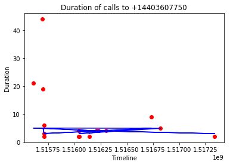
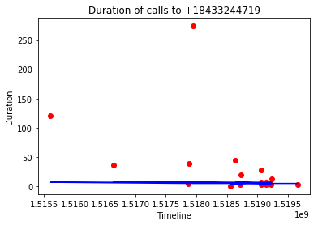

# Epicalls data research

The big picture, what our data

```
select t1.rep_id, t2.number_of_calls, t1.uniq_numbers from (select rep_id, count(distinct number) as uniq_numbers from calls group by rep_id order by rep_id) t1 join (select rep_id, count(*) as number_of_calls from calls group by rep_id order by rep_id) t2
on t1.rep_id = t2.rep_id
```

| rep_id | number\_of\_calls | uniq_numbers |
--------|-----------------|--------------
|      5 |               1 |            1|
|     37 |             196 |          135|
|     40 |             116 |           87|
|     60 |             151 |           57|
|     61 |              23 |           19|
|     67 |               4 |            1|
|     68 |             216 |          153|
|     69 |               2 |            1|
|     70 |               4 |            3|
|     71 |              36 |           33|
|     72 |              13 |            1|

As we can see only ~30% calls repeat, let's look to the most repeated calls

```
select number, count(number) as qty from calls group by number having count(number) > 4 order by qty desc
```

|    number    | qty |
--------------|-----
| +14403607750 |  23|
| +18433244719 |  22|
| +17147814636 |  17|
| +13157673235 |  12|
| +15036415225 |   8|
| +16623783110 |   7|
| +17087718730 |   7|
| +19498911785 |   6|
| +16625786791 |   6|
| +16103060505 |   6|
| +13145043970 |   5|
| +14233169947 |   5|
| +12548530023 |   5|
| +12107143184 |   5|


I took top 2 of them and build a relationship between call duration and call time

### Duration of calls to +14403607750



### Duration of calls to +18433244719



There is no correlation between these parameters, also I don't see a statistically significant frequency of calls.

Conclusion: there are no correlations in the current data set, the next call can be predicted as well as random.

Conclusion 2: We can predict calls only when we know the information about the recipients, recipient number as well as information about rep is not statistically significant data.